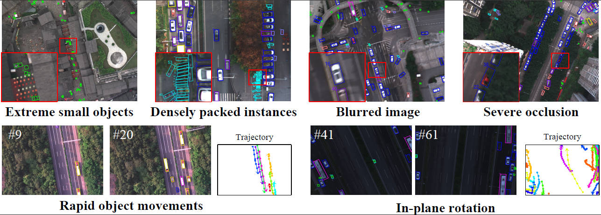

# MMOT: The First Challenging Benchmark for Drone-based Multispectral Multi-Object Tracking

**Li Tianhao**, **Xu Tingfa***, **Wang Ying**, **Qin Haolin**, **Lin Xu**, **Li Jianan***  
*Beijing Institute of Technology*  
Presented at **NeurIPS 2025**  
[[**arXiv**](https://arxiv.org/abs/2510.12565)]

---

## 🆕 Update Log

| Date | Update |
|------|--------|
| 2025-10 | Code and dataset released |
| 2025-10 | Our paper is accepted by NeurIPS 2025 |

---

## ✨ Highlights

**MMOT** is the *first* large-scale benchmark for **drone-based multispectral multi-object tracking (MOT)**.  
It integrates **spectral and temporal cues** to evaluate modern tracking algorithms under real-world UAV conditions.

- **📦 Large Scale** — 125 video sequences, 13.8K frames, 488.8K annotated oriented boxes across 8 categories  
- **🌈 Multispectral Imagery** — 8-band MSI covering visible to near-infrared spectrum  
- **📐 Oriented Bounding Boxes (OBB)** — precise orientation labels for robust aerial association  
- **🚁 Real UAV Scenarios** — varying altitudes (80–200 m), illumination, and dense urban traffic  
- **🧩 Complete Codebase** — integrates 8 representative trackers (SORT, ByteTrack, OC-SORT, BoT-SORT, MOTR, MOTRv2, MeMOTR, MOTIP)  
---

## 📸 Example Visualization

<p align="center">
  
</p>

*Example annotations from MMOT showcasing diverse and challenging scenarios. In these scenes, where spatial features are limited due to small object size, clutter or blur, spectral cues provide critical complementary information for reliable discrimination. Zoom in for better visualization.*

---

## 🧪 Benchmarking Results of MSI Input

|                           |                   | **Class-Averaged** |          |          |          |          | **Detection-Averaged** |          |          |          |          |
| ------------------------- | ----------------- | :----------------: | :------: | :------: | :------: | :------: | :--------------------: | :------: | :------: | :------: | :------: |
| **Type**                  | **Method**        |        HOTA↑       |   MOTA↑  |   IDF1↑  |   DetA↑  |   AssA↑  |          HOTA↑         |   MOTA↑  |   IDF1↑  |   DetA↑  |   AssA↑  |
| **Tracking-by-Detection** | SORT              |        27.2        |   24.3   |   29.1   |   25.7   |   30.0   |          35.0          |   25.7   |   33.7   |   27.6   |   44.8   |
|                           | ByteTrack         |        40.5        |   34.2   |   44.1   |   37.0   |   46.2   |          46.0          |   37.8   |   46.7   |   41.9   |   51.5   |
|                           | OC-SORT           |        29.5        |   25.1   |   31.9   |   27.3   |   32.8   |          37.5          |   27.5   |   37.0   |   29.5   |   48.0   |
|                           | BoT-SORT          |        53.6        |   46.2   |   61.0   |   45.7   |   64.6   |          60.7          |   59.4   |   69.4   |   55.0   |   68.7   |
| **Tracking-by-Query**     | MOTR              |        39.0        |   26.5   |   44.6   |   27.1   |   60.1   |          48.4          |   32.2   |   54.7   |   35.4   |   68.4   |
|                           | MOTRv2            |        49.2        |   43.1   |   57.3   |   37.8   |   67.7   |          54.5          |   50.9   |   64.6   |   44.1   |   68.8   |
|                           | MeMOTR            |        42.3        |   31.3   |   45.9   |   29.3   |   66.3   |          50.9          |   40.8   |   56.0   |   37.1   |   70.9   |
|                           | MOTIP             |        39.0        |   28.8   |   43.9   |   33.8   |   49.6   |          43.1          |   37.3   |   46.3   |   43.7   |   43.8   |


---
## 📂 Dataset Download and Preparation

The **MMOT dataset** can be obtained from the following two sources:

- 🧠 **Hugging Face Repository:** [https://huggingface.co/datasets/Annzstbl/MMOT](https://huggingface.co/datasets/Annzstbl/MMOT/tree/main)  
  On Hugging Face, each video sequence is **individually packaged** into a `.tar` file to support **Croissant file generation**.  
  Each `.tar` archive contains:
  - Multispectral frames in `.npy` format  
  - Frame-wise MOT annotations in `.txt` format (one annotation per frame)

  Example (root folder):

  ```text
  MMOT_DATASET
  ├── train
  │   ├── data30-8
  │   │   ├── 000001.npy
  │   │   ├── 000001.txt
  │   │   ├── 000002.npy
  │   │   ├── 000002.txt
  │   │   └── ...
  │   └── ...
  ├── test
  ```
  Please download all .tar files and place them into the corresponding train/ or test/ folder.
  Then, you can automatically extract and convert the structure to the MMOT standard format using:

  ```bash
  python dataset/huggingface_tar_to_standard.py --root /path/to/root
  ```
  This script will reorganize all tar files and transform the Hugging Face structure into the standard MMOT format.

- 📦 **Baidu Netdisk:（Comming Soon）**
  <!-- The Baidu Netdisk version already uses the standard MMOT structure.
  You can simply extract all .zip files directly under the dataset root directory. -->

📁 **Standard Directory Layout**

  After processing (from either source), your dataset directory should appear as follows:
  ```text
  MMOT_DATASET
  ├── train
  │   ├── npy
  │   │   ├── data23-2
  │   │   │   ├── 000001.npy
  │   │   │   └── 000002.npy
  │   │   ├── data23-3
  │   │   └── ...
  │   └── mot
  │       ├── data23-2.txt
  │       ├── data23-3.txt
  │       └── ...  
  └── test
      ├── npy
      └── mot
  ```

Once the dataset has been organized in the above structure,  
please link it to the main project directory for unified access:

```bash
# Link dataset to project root
ln -s /path/to/MMOT_dataset ./data
```

## 💾 Pretrained Weights

All pretrained weights required for reproducing our benchmark results
can be downloaded from the following Google Drive folder:

👉 [Google Drive – Pretrained Models](https://drive.google.com/drive/folders/1IT0CB7Xdyo7Nbbm7d-xqEqlRe2jB3e26)

After downloading, link the folder to the root of your repository for consistent path access:

```bash
# Link pretrained weights to project root
ln -s /path/to/pretrained_models ./weights
```
---

## ⚙️ Environment Setup

To ensure compatibility across all tracking frameworks, please create **separate conda environments** for different models as shown below.  

### 🔹 Environment 1: MMOT1 (for MOTR / MOTRv2 / MeMOTR)

```bash
conda create -n mmot1 python=3.10
conda activate mmot1

# PyTorch and dependencies
pip install torch==1.13.0+cu116 torchvision==0.14.0+cu116 torchaudio==0.13.0 --extra-index-url https://download.pytorch.org/whl/cu116

pip install -U openmim
mim install mmcv==2.2.0
pip install -r requirements.txt
pip install "numpy<2.0"

# Install local packages
cd $ROOT_PATH/mmot
pip install -v -e .

# Compile Deformable Attention operators
cd $ROOT_PATH/TrackByQuery/MOTR/models/ops
sh make.sh
```

### 🔹 Environment 2: MMOT2 (for MOTIP)

```bash
conda create -n mmot2 python=3.11
conda activate mmot2

pip install torch==2.0.1 torchvision==0.15.2 torchaudio==2.0.2 --index-url https://download.pytorch.org/whl/cu118
conda install matplotlib pyyaml scipy tqdm tensorboard seaborn scikit-learn pandas
pip install opencv-python einops wandb pycocotools timm
pip install -U openmim
mim install mmcv==2.2.0
pip install -r requirements.txt
pip install "numpy<2.0"

# Install local package
cd $ROOT_PATH/mmot
pip install -v -e .

# Compile Deformable Attention operators
cd $ROOT_PATH/TrackByQuery/MOTIP/models/ops
sh make.sh

```

### 🔹 Environment 3: YOLO Environment (for Detection + SORT-family Trackers)
```bash
conda create -n yolo python=3.10
conda activate yolo

pip install torch==1.13.0+cu116 torchvision==0.14.0+cu116 torchaudio==0.13.0 --extra-index-url https://download.pytorch.org/whl/cu116

pip install tifffile
pip install -U openmim
mim install mmcv==2.2.0
pip install "numpy<2.0"

# Install local packages
cd $ROOT_PATH/mmot
pip install -v -e .

cd $ROOT_PATH/TrackByDetection/ultralytics
pip install -v -e .
```

📘 Notes

Each tracking framework  has its own configuration and run instructions, including training, inference, and evaluation pipelines.

Please refer to the readme of [MOTR](./TrackByQuery/MOTR), [MOTRv2](./TrackByQuery/MOTRv2) [MeMOTR](./TrackByQuery/MeMOTR) [MOTIP](./TrackByQuery/MOTIP) [YOLO](./TrackByDetection/ultralytics) [Association Trackers(SORT,ByteTrack,OC-SORT,BoT-SORT)](./TrackByDetection/association) inside each subdirectory for detailed usage:


## 🧮 Evaluation Toolkit

This repository integrates [**TrackEval for MMOT**](./TrackEval) for consistent evaluation using **HOTA**, **MOTA**, **IDF1**, and **CLEAR MOT** metrics.

## ⚖️ License

- **Code License**  
  Each submodule retains the **original license** of its respective repository.  
  Please refer to the `LICENSE` file within each subfolder for detailed terms.

- **Dataset License**  
  The **MMOT dataset** is released under the  [](https://creativecommons.org/licenses/by-nc-nd/4.0/). It is intended for academic research only. You must attribute the original source, and you are not allowed to modify or redistribute the dataset without permission.


## 🙏Acknowledgements

We sincerely thank the contributors and authors of the following open-source projects that served as the backbone or inspiration for our implementations:

* [YOLO](https://github.com/ultralytics/ultralytics)
* [SORT](https://github.com/abewley/sort)
* [ByteTrack](https://github.com/ifzhang/ByteTrack)
* [OC-SORT](https://github.com/noahcao/OC_SORT)
* [BoT-SORT](https://github.com/yezzed/BoT-SORT)
* [MOTR](https://github.com/megvii-research/MOTR)
* [MOTRv2](https://github.com/megvii-research/MOTRv2)
* [MeMOTR](https://github.com/MCG-NJU/MeMOTR)
* [MOTIP](https://github.com/MCG-NJU/MOTIP)
* [TrackEval](https://github.com/JonathonLuiten/TrackEval)

Their open-source efforts have significantly accelerated research progress in the field of multi-object tracking.


<!-- ---

## 📖 Citation

If you use the MMOT dataset, code, or benchmark results in your research, please cite:

```bibtex
@inproceedings{li2025mmot,
  title     = {MMOT: The First Challenging Benchmark for Drone-based Multispectral Multi-Object Tracking},
  author    = {Li, Tianhao and Xu, Tingfa and Wang, Ying and Qin, Haolin and Lin, Xu and Li, Jianan},
  booktitle = {NeurIPS 2025 Datasets and Benchmarks Track},
  year      = {2025},
  url       = {https://github.com/Annzstbl/MMOT}
} -->

